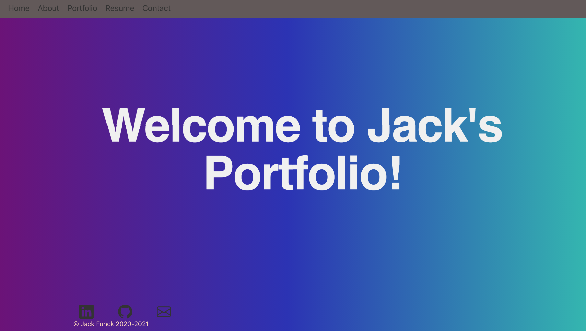

# Unit 20 React Portfolio

by: Jack Funck
## table of Contents:
 - [Link.](#link)
 - [ Description. ](#desc)
 - [ Instructions. ](#instr)
 - [Technologies.](#tc)
 - [Screen-Shots.](#sc)

<a name="link"></a>
## Link
give it a try: <a href="" target="_blank"> Employee Directory</a>

<a name="desc"></a>
## Description
Welcome to My React Portfolio! Using React.js I have built a full responsive portfolio


<a name="instr"></a>
## Instructions
Either "Click" Link([Link.](#link)) above or

Run this command in your Command line
```
npm start
```

<a name="tc"></a>
## Technologies Used
* Node.js
* bootstrap
* React


<a name="sc"></a>
# Screen Shots
### Home


### About


### Portfolio


### Resume


### Contact


